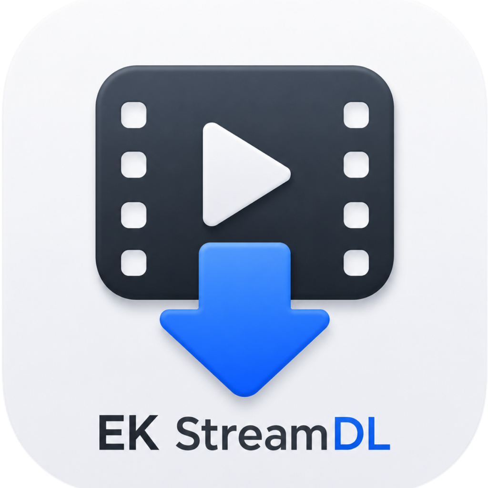
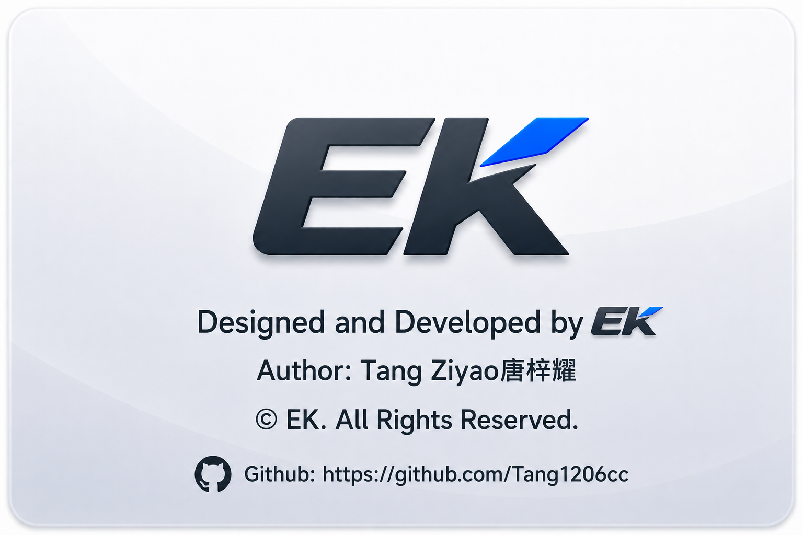

<p align="center">
  
</p>

<h1 align="center">EK StreamDL</h1>

<p align="center">
  面向 macOS 与 Windows 的本地流媒体视频解析与下载工具<br>
  A native macOS and Windows app for parsing and downloading streaming video
</p>

<p align="center">
  <a href="#简体中文"></a>
  <a href="#english"></a>
  <a href="https://github.com/Tang1206cc/EK-Streaming-Video-Downloader/releases/latest"></a>
</p>

<p align="center">
  <a href="https://github.com/Tang1206cc/EK-Streaming-Video-Downloader/releases"></a>
  <a href="https://github.com/Tang1206cc/EK-Streaming-Video-Downloader/issues"></a>
  
  
  
</p>

<p align="center">
  
</p>

---

<a id="简体中文"></a>

## 简体中文

EK StreamDL 是一款在 macOS 与 Windows 本地运行的流媒体视频解析与下载工具。它把链接识别、内容信息读取、下载队列、音视频处理、运行环境配置和应用更新集中在桌面应用中，适合希望少做命令行配置、直接管理下载任务的用户。

当前正式发行版支持 **Apple Silicon（arm64）Mac**（最低 **macOS 13**）与 **Windows x64**。

### 支持的平台

| 平台 | 已识别的常见链接 | 当前能力与注意事项 |
| --- | --- | --- |
| 哔哩哔哩 | `bilibili.com`、`b23.tv` | 单视频解析与下载；可识别分 P、合集或番剧条目并选择下载 |
| 抖音 | `douyin.com`、`v.douyin.com`、`iesdouyin.com` | 视频及图文作品处理；抖音合集列表目前可能无法完整呈现，必要时请逐条解析 |
| 快手 / Kwai | `kuaishou.com`、`v.kuaishou.com`、`kwai.com` | 分享链接解析、清晰度信息读取与下载 |
| 小红书 | `xiaohongshu.com`、`xhslink.com` | 分享链接解析、作品信息补全与下载 |
| 今日头条 | `toutiao.com` | 文章视频及短链接解析与下载 |
| 微信视频号 | `weixin.qq.com/sph/...`、视频号预览链接 | 读取公开预览信息；首次下载时可能需要在独立的腾讯页面完成微信授权，授权可在应用内清理 |

平台页面、接口和访问策略会持续变化。只有公开、有效且当前网络可访问的内容才能被正常解析；部分内容可能因地区、账号、版权、风控或平台改版而不可用。

### 核心能力

| 模块 | 实际能力 |
| --- | --- |
| 链接输入 | 可直接粘贴 URL，也可粘贴包含标题和链接的整段分享文本；应用会提取其中的第一个有效链接 |
| 信息解析 | 展示平台、标题、作者、发布日期、时长、封面、可用格式说明和可获取时的预估大小 |
| 下载模式 | 完整视频、仅音频、仅视频、音视频分开 |
| 合集选择 | 对可识别的多条目内容选择单集、多集或全部；输出文件按条目顺序命名 |
| 下载队列 | 最多同时执行 2 个任务；支持单项或全部暂停、继续、重试和删除 |
| 状态保留 | 保存下载目录、下载模式、完成提示音和任务列表；应用重启后，未完成任务会转为可重新开始的暂停状态 |
| 文件管理 | 默认保存到系统“下载”文件夹，也可选择其他目录；重名文件会自动使用新的文件名，避免覆盖原文件 |
| 封面与提示 | 可单独下载作品封面；可开启或关闭下载完成提示音 |
| 环境配置 | 检查 macOS、下载目录、平台网络、`yt-dlp` 与 `ffmpeg`；缺失时可安装应用专用副本，并可导出诊断报告 |
| 个性化 | 简体中文、繁体中文、English；跟随系统、浅色、深色主题；开机启动、Esc 退出、关闭末尾窗口时退出等设置 |
| 应用更新 | 启动时可自动检查 GitHub Release，也可手动检查；支持在应用内下载、校验、安装并重新启动新版本 |

### 下载与安装

1. 前往 [最新 Release](https://github.com/Tang1206cc/EK-Streaming-Video-Downloader/releases/latest)。
2. macOS 下载 `macOS-arm64-EK.StreamDL-<版本号>.zip`，Windows 下载 `windows-x64-EK.StreamDL-<版本号>.zip`。
3. macOS 解压后将 `EK StreamDL.app` 放入“应用程序”文件夹；Windows 解压后运行 `EK StreamDL.exe`。
4. 首次使用建议点击主界面的“配置所需环境”，完成检查并按提示安装或更新 `yt-dlp` 与 `ffmpeg`。

macOS 发布包为 arm64 构建，适用于 Apple Silicon Mac；Windows 发布包适用于 x64 设备。Intel Mac 暂无可用正式版本。

### 基本使用

1. 复制受支持平台的公开视频链接或整段分享文本。
2. 粘贴到 EK StreamDL，点击“解析”。
3. 检查标题、作者、时长、封面和下载信息；如识别到合集，先选择需要的条目。
4. 选择下载模式和保存目录，然后点击“下载”。
5. 在下载列表中查看进度，或暂停、继续、重试、删除任务。

下载模式的结果会根据来源媒体而略有差异：

| 模式 | 通常输出 |
| --- | --- |
| 完整视频 | 合并音频与视频后的 MP4，或平台可直接提供的完整媒体文件 |
| 仅音频 | 提取后的 M4A；部分来源或图文作品可能输出 MP3 |
| 仅视频 | 不含音轨的 MP4 |
| 音视频分开 | 独立的视频文件和音频文件 |

### 运行组件与数据位置

真实解析和下载依赖：

- [`yt-dlp`](https://github.com/yt-dlp/yt-dlp)：解析公开视频页面并获取可下载媒体。
- [`ffmpeg`](https://ffmpeg.org/)：合并音视频、提取音频、生成仅视频文件以及执行下载后校验和处理。

普通用户无需预先安装 Xcode、Node.js 或 Homebrew。应用会优先复用可用组件；缺失时，“配置所需环境”会把应用专用副本安装到：

```text
~/Library/Application Support/EK StreamDL/Tools
```

自动配置需要联网，组件下载支持断点续传和最多 3 次重试，并进行 SHA-256 完整性校验。开发者也可以自行安装工具，或通过以下环境变量指定可执行文件：

```text
EK_STREAMDL_YTDLP_PATH
EK_STREAMDL_FFMPEG_PATH
```

### 项目结构

```text
.
├── README.md                         # 仓库总览（中文 / English）
├── macos/
│   ├── EK StreamDL.xcodeproj/        # 当前正式 macOS 工程
│   ├── EKStreamDL/App/               # SwiftUI、WKWebView、原生桥、解析下载服务
│   │   └── Update/                   # GitHub Release 检查、下载与安装
│   ├── UpdaterHelper/                # 更新替换与重新启动辅助程序
│   ├── src/                          # React/Vite 界面、状态、国际化与平台适配层
│   ├── public/                       # 品牌与关于页面素材
│   └── dist/                         # Xcode 打包使用的已构建 Web UI
├── win/                              # Windows x64 Electron 正式工程
└── release-artifacts/                # 仓库中保留的既有发行附件
```

当前发行路径是 **SwiftUI + WKWebView + React/Vite**：SwiftUI 负责原生应用生命周期、设置窗口和系统集成，WKWebView 承载界面，原生桥把界面请求交给 Swift 服务执行。仓库内保留的 Electron 入口用于 Web 层开发/试验，不是当前 macOS 正式发行入口。

### 本地开发与验证

准备完整 Xcode。只有在修改 Web UI 或运行前端测试时，才需要 Node.js 与 `pnpm`。

```sh
cd macos
pnpm install
pnpm test
pnpm run build:web
open "EK StreamDL.xcodeproj"
```

在 Xcode 中选择 `EK StreamDL` scheme 后运行。也可以进行命令行构建验证：

```sh
xcodebuild \
  -project "EK StreamDL.xcodeproj" \
  -scheme "EK StreamDL" \
  -configuration Debug \
  -derivedDataPath ./.xcode-derived \
  CODE_SIGNING_ALLOWED=NO \
  build
```

Web UI 修改后必须重新执行 `pnpm run build:web`，因为原生应用加载的是 `macos/dist/` 中的构建结果。

### Release 与更新附件约定

应用更新器依赖附件的精确名称。发布新版本时，大小写、空格/点号、连字符、平台架构、产品名、版本号顺序和扩展名都不能随意更改。

- 当前 macOS arm64 标准名称：`macOS-arm64-EK.StreamDL-<版本号>.zip`
- 当前 Windows x64 标准名称：`windows-x64-EK.StreamDL-<版本号>.zip`
- 更新器仍兼容既有 `macOS-universal-EK StreamDL-<版本号>.zip` 等旧名称，但新 macOS 正式版本应使用 arm64 标准名称。

更新器会忽略草稿和预发布版本，并在安装前核对应用 Bundle ID 与 Release 版本号。

### 隐私、合规与限制

- EK StreamDL 面向公开内容，不用于绕过付费、私有、访问控制或版权保护措施。
- 请只下载你有权保存和使用的内容，并遵守所在地法律及对应平台的服务条款。用户对自己的使用行为负责。
- 解析和下载会直接访问对应平台、GitHub 以及运行组件的发行源；项目没有自建账号系统或遥测服务。
- 微信视频号授权发生在腾讯提供的独立页面中，并非 EK StreamDL 自有登录；可在应用内清理本地授权状态。
- 平台改版可能暂时影响解析能力。反馈问题时，建议附上平台、链接类型、应用版本、macOS 版本和应用导出的诊断报告；请先移除个人或敏感信息。

### 许可与作者

本仓库目前未附带开源许可证。除第三方组件各自适用的许可证外，项目代码、品牌与素材保留所有权利；使用、修改或再分发前请先取得作者授权。

<p align="center">
  
</p>

---

<a id="english"></a>

## English

EK StreamDL is a local macOS and Windows app for parsing and downloading streaming video. It brings link detection, metadata parsing, download modes, queue control, media processing, runtime setup, and app updates into one desktop workflow.

The current public build supports **Apple Silicon (arm64) Macs** running **macOS 13 or later**, plus **Windows x64**.

### Supported platforms

| Platform | Common recognized links | Current behavior and notes |
| --- | --- | --- |
| Bilibili | `bilibili.com`, `b23.tv` | Parses and downloads individual videos; can detect selectable multi-part, collection, or season entries |
| Douyin | `douyin.com`, `v.douyin.com`, `iesdouyin.com` | Handles video and image posts; collection lists may be incomplete, so some items need to be parsed separately |
| Kuaishou / Kwai | `kuaishou.com`, `v.kuaishou.com`, `kwai.com` | Parses share links, reads available quality information, and downloads media |
| Xiaohongshu | `xiaohongshu.com`, `xhslink.com` | Parses share links, supplements post metadata, and downloads media |
| Toutiao | `toutiao.com` | Parses and downloads article videos and short links |
| WeChat Channels | `weixin.qq.com/sph/...` and Channels preview links | Reads public preview data; the first download may require WeChat authorization in a separate Tencent page, which can later be cleared in the app |

Platform pages, APIs, and access rules change over time. A link must refer to public, valid, and network-accessible content. Region, account, copyright, risk-control, or platform changes can still prevent parsing or downloading.

### Main capabilities

| Area | What the app currently does |
| --- | --- |
| Link input | Accepts a direct URL or an entire share message and extracts the first valid link |
| Metadata | Shows platform, title, author, publication date, duration, cover, format notes, and an estimated size when available |
| Download modes | Complete video, audio only, video only, or separate audio and video |
| Collections | Lets you select one, multiple, or all detected entries and names output files in entry order |
| Queue control | Runs up to 2 downloads in parallel; supports per-task and bulk pause, resume/retry, and deletion |
| Persistence | Keeps the selected folder, download mode, completion-sound preference, and task list; unfinished tasks become restartable paused tasks after relaunch |
| File handling | Uses the system Downloads folder by default, supports a custom folder, and avoids overwriting existing files |
| Cover and notification | Downloads the cover separately and optionally plays a completion sound |
| Runtime setup | Checks macOS, the download folder, platform connectivity, `yt-dlp`, and `ffmpeg`; installs app-specific copies when needed and exports diagnostics |
| Personalization | Simplified Chinese, Traditional Chinese, and English; system/light/dark appearance; launch-at-login, Esc-to-quit, and last-window behavior |
| Updates | Automatically or manually checks GitHub Releases and can download, validate, install, and relaunch a new version in the app |

### Download and install

1. Open the [latest Release](https://github.com/Tang1206cc/EK-Streaming-Video-Downloader/releases/latest).
2. On macOS, download `macOS-arm64-EK.StreamDL-<version>.zip`; on Windows, download `windows-x64-EK.StreamDL-<version>.zip`.
3. On macOS, unzip it and move `EK StreamDL.app` to Applications. On Windows, unzip it and run `EK StreamDL.exe`.
4. On first use, open “Runtime Setup” from the main window, run the check, and install or update `yt-dlp` and `ffmpeg` when prompted.

The macOS release is an arm64 build for Apple Silicon, while the Windows release supports x64 systems. Intel Macs are not currently supported.

### Basic workflow

1. Copy a public video URL or share message from a supported platform.
2. Paste it into EK StreamDL and select Parse.
3. Review the title, author, duration, cover, and download information. Select entries if a collection is detected.
4. Choose a download mode and destination, then start the download.
5. Use the download list to monitor, pause, resume, retry, or remove tasks.

Output varies slightly by source:

| Mode | Typical output |
| --- | --- |
| Complete video | An MP4 with audio and video merged, or the complete media file supplied by the platform |
| Audio only | Extracted M4A; some sources or image posts may produce MP3 |
| Video only | MP4 without an audio track |
| Separate audio and video | Independent video and audio files |

### Runtime components and data location

Real parsing and downloading depend on:

- [`yt-dlp`](https://github.com/yt-dlp/yt-dlp) for parsing public pages and locating downloadable media.
- [`ffmpeg`](https://ffmpeg.org/) for merging, extracting, converting, validating, and post-processing media.

Regular users do not need Xcode, Node.js, or Homebrew. The app reuses a suitable existing tool when possible; otherwise Runtime Setup installs an app-specific copy in:

```text
~/Library/Application Support/EK StreamDL/Tools
```

Automatic setup requires a network connection, supports resumable downloads and up to 3 retries, and verifies downloads with SHA-256. Developers may also provide tool paths through:

```text
EK_STREAMDL_YTDLP_PATH
EK_STREAMDL_FFMPEG_PATH
```

### Architecture

```text
.
├── README.md                         # Repository overview (Chinese / English)
├── macos/
│   ├── EK StreamDL.xcodeproj/        # Current production macOS project
│   ├── EKStreamDL/App/               # SwiftUI, WKWebView, native bridge, parsing/downloading
│   │   └── Update/                   # GitHub Release checks, download, and installation
│   ├── UpdaterHelper/                # App replacement and relaunch helper
│   ├── src/                          # React/Vite UI, state, i18n, and platform adapters
│   ├── public/                       # Brand and About assets
│   └── dist/                         # Built Web UI embedded by Xcode
├── win/                              # Production Windows x64 Electron app
└── release-artifacts/                # Historical release assets kept in the repository
```

The production app uses **SwiftUI + WKWebView + React/Vite**. SwiftUI owns the app lifecycle, Preferences window, and native system integration; WKWebView renders the interface; and a native bridge forwards UI operations to Swift services. Electron entry files remain as Web-layer development scaffolding and are not the current macOS release entry point.

### Local development and verification

A full Xcode installation is required. Node.js and `pnpm` are needed only when changing the Web UI or running its tests.

```sh
cd macos
pnpm install
pnpm test
pnpm run build:web
open "EK StreamDL.xcodeproj"
```

Select the `EK StreamDL` scheme in Xcode and run it. A command-line build can be used for verification:

```sh
xcodebuild \
  -project "EK StreamDL.xcodeproj" \
  -scheme "EK StreamDL" \
  -configuration Debug \
  -derivedDataPath ./.xcode-derived \
  CODE_SIGNING_ALLOWED=NO \
  build
```

After changing the Web UI, always run `pnpm run build:web` again because the native app loads the built files from `macos/dist/`.

### Release and updater asset contract

The updater depends on exact asset names. Case, spaces or dots, hyphens, platform and architecture labels, product name, version order, and file extension must remain unchanged.

- Current macOS arm64 name: `macOS-arm64-EK.StreamDL-<version>.zip`
- Current Windows x64 name: `windows-x64-EK.StreamDL-<version>.zip`
- The updater remains compatible with legacy names such as `macOS-universal-EK StreamDL-<version>.zip`, but new production macOS releases should use the arm64 name.

The updater ignores draft and prerelease entries and validates the app bundle identifier and Release version before installation.

### Privacy, responsible use, and limitations

- EK StreamDL is intended for public content. It is not designed to bypass payment, privacy, access control, or copyright protection.
- Download only content you are authorized to save and use, and follow applicable laws and platform terms. You are responsible for how you use the app.
- Parsing and downloading connect directly to the relevant platforms, GitHub, and runtime-component distribution sources. The project has no first-party account system or telemetry service.
- WeChat Channels authorization takes place on a separate page provided by Tencent, not in an EK StreamDL account system. Its local authorization state can be cleared in the app.
- Platform changes may temporarily break parsing. When reporting a problem, include the platform, link type, app version, macOS version, and an exported diagnostic report after removing personal or sensitive information.

### License and author

This repository currently has no open-source license. Except for third-party components under their respective licenses, all rights to the project code, brand, and assets are reserved. Obtain permission from the author before using, modifying, or redistributing them.

<p align="center">
  
</p>
