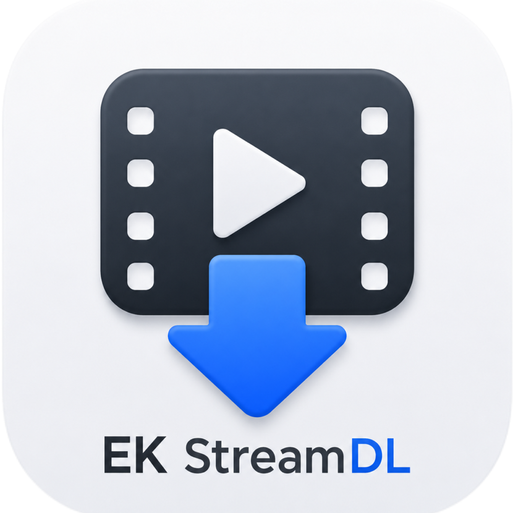
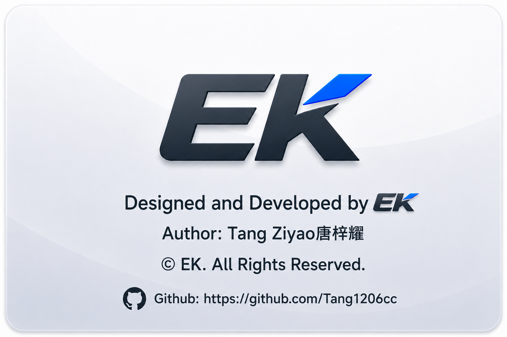

<p align="center">
  
</p>

<h1 align="center">EK StreamDL</h1>

<p align="center">
  面向 macOS 与 Windows 的本地流媒体视频解析与下载工具<br>
  A native macOS and Windows app for parsing and downloading streaming video
</p>

<p align="center">
  <a href="#简体中文"></a>
  <a href="#english"></a>
  <a href="#繁體中文"></a>
  <a href="#日本語"></a>
  <a href="https://github.com/Tang1206cc/EK-Streaming-Video-Downloader/releases/latest"></a>
</p>

<p align="center">
  <a href="https://github.com/Tang1206cc/EK-Streaming-Video-Downloader/releases"></a>
  <a href="https://github.com/Tang1206cc/EK-Streaming-Video-Downloader/issues"></a>
  
  
  
</p>

<p align="center">
  
</p>

---

<a id="简体中文"></a>

## 简体中文

EK StreamDL 是一款在 macOS 与 Windows 本地运行的流媒体视频解析与下载工具。它把链接识别、内容信息读取、下载队列、音视频处理、运行环境配置和应用更新集中在桌面应用中，适合希望少做命令行配置、直接管理下载任务的用户。

当前正式发行版支持 **Apple Silicon（arm64）Mac**（最低 **macOS 13**）与 **Windows x64**。

### 支持的平台

| 平台 | 已识别的常见链接 | 当前能力与注意事项 |
| --- | --- | --- |
| 哔哩哔哩 | `bilibili.com`、`b23.tv` | 单视频解析与下载；可识别分 P、合集或番剧条目并选择下载 |
| 抖音 | `douyin.com`、`v.douyin.com`、`iesdouyin.com` | 视频及图文作品处理；抖音合集列表目前可能无法完整呈现，必要时请逐条解析 |
| 快手 / Kwai | `kuaishou.com`、`v.kuaishou.com`、`kwai.com` | 分享链接解析、清晰度信息读取与下载 |
| 小红书 | `xiaohongshu.com`、`xhslink.com` | 分享链接解析、作品信息补全与下载 |
| 今日头条 | `toutiao.com` | 文章视频及短链接解析与下载 |
| 微信视频号 | `weixin.qq.com/sph/...`、视频号预览链接 | 读取公开预览信息；首次下载时可能需要在独立的腾讯页面完成微信授权，授权可在应用内清理 |

平台页面、接口和访问策略会持续变化。只有公开、有效且当前网络可访问的内容才能被正常解析；部分内容可能因地区、账号、版权、风控或平台改版而不可用。

### 核心能力

| 模块 | 实际能力 |
| --- | --- |
| 链接输入 | 可直接粘贴 URL，也可粘贴包含标题和链接的整段分享文本；应用会提取其中的第一个有效链接 |
| 信息解析 | 展示平台、标题、作者、发布日期、时长、封面、可用格式说明和可获取时的预估大小 |
| 下载模式 | 完整视频、仅音频、仅视频、音视频分开 |
| 合集选择 | 对可识别的多条目内容选择单集、多集或全部；输出文件按条目顺序命名 |
| 下载队列 | 最多同时执行 2 个任务；支持单项或全部暂停、继续、重试和删除 |
| 状态保留 | 保存下载目录、下载模式、完成提示音和任务列表；应用重启后，未完成任务会转为可重新开始的暂停状态 |
| 文件管理 | 默认保存到系统“下载”文件夹，也可选择其他目录；重名文件会自动使用新的文件名，避免覆盖原文件 |
| 封面与提示 | 可单独下载作品封面；可开启或关闭下载完成提示音 |
| 环境配置 | 检查 macOS、下载目录、平台网络、`yt-dlp` 与 `ffmpeg`；缺失时可安装应用专用副本，并可导出诊断报告 |
| 个性化 | 简体中文、繁体中文、English、日本語；跟随系统、浅色、深色主题；开机启动、Esc 退出、关闭末尾窗口时退出等设置 |
| 应用更新 | 启动时可自动检查 GitHub Release，也可手动检查；支持在应用内下载、校验、安装并重新启动新版本 |

### 下载与安装

1. 前往 [最新 Release](https://github.com/Tang1206cc/EK-Streaming-Video-Downloader/releases/latest)。
2. macOS 下载 `macOS-arm64-EK.StreamDL-<版本号>.zip`，Windows 下载 `windows-x64-EK.StreamDL-<版本号>.zip`。
3. macOS 解压后将 `EK StreamDL.app` 放入“应用程序”文件夹；Windows 解压后运行 `EK StreamDL.exe`。
4. 首次使用建议点击主界面的“配置所需环境”，完成检查并按提示安装或更新 `yt-dlp` 与 `ffmpeg`。

macOS 发布包为 arm64 构建，适用于 Apple Silicon Mac；Windows 发布包适用于 x64 设备。Intel Mac 暂无可用正式版本。

### 基本使用

1. 复制受支持平台的公开视频链接或整段分享文本。
2. 粘贴到 EK StreamDL，点击“解析”。
3. 检查标题、作者、时长、封面和下载信息；如识别到合集，先选择需要的条目。
4. 选择下载模式和保存目录，然后点击“下载”。
5. 在下载列表中查看进度，或暂停、继续、重试、删除任务。

下载模式的结果会根据来源媒体而略有差异：

| 模式 | 通常输出 |
| --- | --- |
| 完整视频 | 合并音频与视频后的 MP4，或平台可直接提供的完整媒体文件 |
| 仅音频 | 提取后的 M4A；部分来源或图文作品可能输出 MP3 |
| 仅视频 | 不含音轨的 MP4 |
| 音视频分开 | 独立的视频文件和音频文件 |

### 运行组件与数据位置

真实解析和下载依赖：

- [`yt-dlp`](https://github.com/yt-dlp/yt-dlp)：解析公开视频页面并获取可下载媒体。
- [`ffmpeg`](https://ffmpeg.org/)：合并音视频、提取音频、生成仅视频文件以及执行下载后校验和处理。

普通用户无需预先安装 Xcode、Node.js 或 Homebrew。当前双端发行包均随附可直接使用的基础组件，也会优先复用设备上合适的现有工具；“配置所需环境”可检查并按需更新应用专用副本，保存位置为：

```text
~/Library/Application Support/EK StreamDL/Tools
```

自动配置需要联网，组件下载支持断点续传和最多 3 次重试，并进行 SHA-256 完整性校验。开发者也可以自行安装工具，或通过以下环境变量指定可执行文件：

```text
EK_STREAMDL_YTDLP_PATH
EK_STREAMDL_FFMPEG_PATH
```

### 项目结构

```text
.
├── README.md                         # 仓库总览（简中 / English / 繁中 / 日本語）
├── macos/
│   ├── EK StreamDL.xcodeproj/        # 当前正式 macOS 工程
│   ├── EKStreamDL/App/               # SwiftUI、WKWebView、原生桥、解析下载服务
│   │   └── Update/                   # GitHub Release 检查、下载与安装
│   ├── UpdaterHelper/                # 更新替换与重新启动辅助程序
│   ├── src/                          # React/Vite 界面、状态、国际化与平台适配层
│   ├── public/                       # 品牌与关于页面素材
│   └── dist/                         # Xcode 打包使用的已构建 Web UI
├── win/                              # Windows x64 Electron 正式工程
└── release-artifacts/                # 仓库中保留的既有发行附件
```

当前发行路径是 **SwiftUI + WKWebView + React/Vite**：SwiftUI 负责原生应用生命周期、设置窗口和系统集成，WKWebView 承载界面，原生桥把界面请求交给 Swift 服务执行。仓库内保留的 Electron 入口用于 Web 层开发/试验，不是当前 macOS 正式发行入口。

### 本地开发与验证

准备完整 Xcode。只有在修改 Web UI 或运行前端测试时，才需要 Node.js 与 `pnpm`。

```sh
cd macos
pnpm install
pnpm test
pnpm run build:web
open "EK StreamDL.xcodeproj"
```

在 Xcode 中选择 `EK StreamDL` scheme 后运行。也可以进行命令行构建验证：

```sh
xcodebuild \
  -project "EK StreamDL.xcodeproj" \
  -scheme "EK StreamDL" \
  -configuration Debug \
  -derivedDataPath ./.xcode-derived \
  CODE_SIGNING_ALLOWED=NO \
  build
```

Web UI 修改后必须重新执行 `pnpm run build:web`，因为原生应用加载的是 `macos/dist/` 中的构建结果。

### Release 与更新附件约定

应用更新器依赖附件的精确名称。发布新版本时，大小写、空格/点号、连字符、平台架构、产品名、版本号顺序和扩展名都不能随意更改。

- 当前 macOS arm64 标准名称：`macOS-arm64-EK.StreamDL-<版本号>.zip`
- 当前 Windows x64 标准名称：`windows-x64-EK.StreamDL-<版本号>.zip`
- 更新器仍兼容既有 `macOS-universal-EK StreamDL-<版本号>.zip` 等旧名称，但新 macOS 正式版本应使用 arm64 标准名称。

更新器会忽略草稿和预发布版本，并在安装前核对应用 Bundle ID 与 Release 版本号。

### 隐私、合规与限制

- EK StreamDL 面向公开内容，不用于绕过付费、私有、访问控制或版权保护措施。
- 请只下载你有权保存和使用的内容，并遵守所在地法律及对应平台的服务条款。用户对自己的使用行为负责。
- 解析和下载会直接访问对应平台、GitHub 以及运行组件的发行源；项目没有自建账号系统或遥测服务。
- 微信视频号授权发生在腾讯提供的独立页面中，并非 EK StreamDL 自有登录；可在应用内清理本地授权状态。
- 平台改版可能暂时影响解析能力。反馈问题时，建议附上平台、链接类型、应用版本、macOS 版本和应用导出的诊断报告；请先移除个人或敏感信息。

### 许可与作者

本仓库目前未附带开源许可证。除第三方组件各自适用的许可证外，项目代码、品牌与素材保留所有权利；使用、修改或再分发前请先取得作者授权。

<p align="center">
  
</p>

---

<a id="english"></a>

## English

EK StreamDL is a local macOS and Windows app for parsing and downloading streaming video. It brings link detection, metadata parsing, download modes, queue control, media processing, runtime setup, and app updates into one desktop workflow.

The current public build supports **Apple Silicon (arm64) Macs** running **macOS 13 or later**, plus **Windows x64**.

### Supported platforms

| Platform | Common recognized links | Current behavior and notes |
| --- | --- | --- |
| Bilibili | `bilibili.com`, `b23.tv` | Parses and downloads individual videos; can detect selectable multi-part, collection, or season entries |
| Douyin | `douyin.com`, `v.douyin.com`, `iesdouyin.com` | Handles video and image posts; collection lists may be incomplete, so some items need to be parsed separately |
| Kuaishou / Kwai | `kuaishou.com`, `v.kuaishou.com`, `kwai.com` | Parses share links, reads available quality information, and downloads media |
| Xiaohongshu | `xiaohongshu.com`, `xhslink.com` | Parses share links, supplements post metadata, and downloads media |
| Toutiao | `toutiao.com` | Parses and downloads article videos and short links |
| WeChat Channels | `weixin.qq.com/sph/...` and Channels preview links | Reads public preview data; the first download may require WeChat authorization in a separate Tencent page, which can later be cleared in the app |

Platform pages, APIs, and access rules change over time. A link must refer to public, valid, and network-accessible content. Region, account, copyright, risk-control, or platform changes can still prevent parsing or downloading.

### Main capabilities

| Area | What the app currently does |
| --- | --- |
| Link input | Accepts a direct URL or an entire share message and extracts the first valid link |
| Metadata | Shows platform, title, author, publication date, duration, cover, format notes, and an estimated size when available |
| Download modes | Complete video, audio only, video only, or separate audio and video |
| Collections | Lets you select one, multiple, or all detected entries and names output files in entry order |
| Queue control | Runs up to 2 downloads in parallel; supports per-task and bulk pause, resume/retry, and deletion |
| Persistence | Keeps the selected folder, download mode, completion-sound preference, and task list; unfinished tasks become restartable paused tasks after relaunch |
| File handling | Uses the system Downloads folder by default, supports a custom folder, and avoids overwriting existing files |
| Cover and notification | Downloads the cover separately and optionally plays a completion sound |
| Runtime setup | Checks macOS, the download folder, platform connectivity, `yt-dlp`, and `ffmpeg`; installs app-specific copies when needed and exports diagnostics |
| Personalization | Simplified Chinese, Traditional Chinese, English, and Japanese; system/light/dark appearance; launch-at-login, Esc-to-quit, and last-window behavior |
| Updates | Automatically or manually checks GitHub Releases and can download, validate, install, and relaunch a new version in the app |

### Download and install

1. Open the [latest Release](https://github.com/Tang1206cc/EK-Streaming-Video-Downloader/releases/latest).
2. On macOS, download `macOS-arm64-EK.StreamDL-<version>.zip`; on Windows, download `windows-x64-EK.StreamDL-<version>.zip`.
3. On macOS, unzip it and move `EK StreamDL.app` to Applications. On Windows, unzip it and run `EK StreamDL.exe`.
4. On first use, open “Runtime Setup” from the main window, run the check, and install or update `yt-dlp` and `ffmpeg` when prompted.

The macOS release is an arm64 build for Apple Silicon, while the Windows release supports x64 systems. Intel Macs are not currently supported.

### Basic workflow

1. Copy a public video URL or share message from a supported platform.
2. Paste it into EK StreamDL and select Parse.
3. Review the title, author, duration, cover, and download information. Select entries if a collection is detected.
4. Choose a download mode and destination, then start the download.
5. Use the download list to monitor, pause, resume, retry, or remove tasks.

Output varies slightly by source:

| Mode | Typical output |
| --- | --- |
| Complete video | An MP4 with audio and video merged, or the complete media file supplied by the platform |
| Audio only | Extracted M4A; some sources or image posts may produce MP3 |
| Video only | MP4 without an audio track |
| Separate audio and video | Independent video and audio files |

### Runtime components and data location

Real parsing and downloading depend on:

- [`yt-dlp`](https://github.com/yt-dlp/yt-dlp) for parsing public pages and locating downloadable media.
- [`ffmpeg`](https://ffmpeg.org/) for merging, extracting, converting, validating, and post-processing media.

Regular users do not need Xcode, Node.js, or Homebrew. Current builds for both platforms include ready-to-use baseline components and also reuse suitable tools already on the device. Runtime Setup can check and update app-specific copies as needed in:

```text
~/Library/Application Support/EK StreamDL/Tools
```

Automatic setup requires a network connection, supports resumable downloads and up to 3 retries, and verifies downloads with SHA-256. Developers may also provide tool paths through:

```text
EK_STREAMDL_YTDLP_PATH
EK_STREAMDL_FFMPEG_PATH
```

### Architecture

```text
.
├── README.md                         # Repository overview (Simplified Chinese / English / Traditional Chinese / Japanese)
├── macos/
│   ├── EK StreamDL.xcodeproj/        # Current production macOS project
│   ├── EKStreamDL/App/               # SwiftUI, WKWebView, native bridge, parsing/downloading
│   │   └── Update/                   # GitHub Release checks, download, and installation
│   ├── UpdaterHelper/                # App replacement and relaunch helper
│   ├── src/                          # React/Vite UI, state, i18n, and platform adapters
│   ├── public/                       # Brand and About assets
│   └── dist/                         # Built Web UI embedded by Xcode
├── win/                              # Production Windows x64 Electron app
└── release-artifacts/                # Historical release assets kept in the repository
```

The production app uses **SwiftUI + WKWebView + React/Vite**. SwiftUI owns the app lifecycle, Preferences window, and native system integration; WKWebView renders the interface; and a native bridge forwards UI operations to Swift services. Electron entry files remain as Web-layer development scaffolding and are not the current macOS release entry point.

### Local development and verification

A full Xcode installation is required. Node.js and `pnpm` are needed only when changing the Web UI or running its tests.

```sh
cd macos
pnpm install
pnpm test
pnpm run build:web
open "EK StreamDL.xcodeproj"
```

Select the `EK StreamDL` scheme in Xcode and run it. A command-line build can be used for verification:

```sh
xcodebuild \
  -project "EK StreamDL.xcodeproj" \
  -scheme "EK StreamDL" \
  -configuration Debug \
  -derivedDataPath ./.xcode-derived \
  CODE_SIGNING_ALLOWED=NO \
  build
```

After changing the Web UI, always run `pnpm run build:web` again because the native app loads the built files from `macos/dist/`.

### Release and updater asset contract

The updater depends on exact asset names. Case, spaces or dots, hyphens, platform and architecture labels, product name, version order, and file extension must remain unchanged.

- Current macOS arm64 name: `macOS-arm64-EK.StreamDL-<version>.zip`
- Current Windows x64 name: `windows-x64-EK.StreamDL-<version>.zip`
- The updater remains compatible with legacy names such as `macOS-universal-EK StreamDL-<version>.zip`, but new production macOS releases should use the arm64 name.

The updater ignores draft and prerelease entries and validates the app bundle identifier and Release version before installation.

### Privacy, responsible use, and limitations

- EK StreamDL is intended for public content. It is not designed to bypass payment, privacy, access control, or copyright protection.
- Download only content you are authorized to save and use, and follow applicable laws and platform terms. You are responsible for how you use the app.
- Parsing and downloading connect directly to the relevant platforms, GitHub, and runtime-component distribution sources. The project has no first-party account system or telemetry service.
- WeChat Channels authorization takes place on a separate page provided by Tencent, not in an EK StreamDL account system. Its local authorization state can be cleared in the app.
- Platform changes may temporarily break parsing. When reporting a problem, include the platform, link type, app version, macOS version, and an exported diagnostic report after removing personal or sensitive information.

### License and author

This repository currently has no open-source license. Except for third-party components under their respective licenses, all rights to the project code, brand, and assets are reserved. Obtain permission from the author before using, modifying, or redistributing them.

<p align="center">
  
</p>

---

<a id="繁體中文"></a>

## 繁體中文

EK StreamDL 是一款在 macOS 與 Windows 本機執行的串流影音解析與下載工具。它將連結識別、內容資訊讀取、下載佇列、影音處理、執行環境設定與應用程式更新整合在桌面應用程式中，適合希望減少命令列設定、直接管理下載任務的使用者。

目前正式發行版支援 **Apple Silicon（arm64）Mac**（最低 **macOS 13**）與 **Windows x64**。

### 支援的平台

| 平台 | 可識別的常見連結 | 目前能力與注意事項 |
| --- | --- | --- |
| Bilibili | `bilibili.com`、`b23.tv` | 單一影片解析與下載；可識別分 P、合集或番劇項目並選擇下載 |
| 抖音 | `douyin.com`、`v.douyin.com`、`iesdouyin.com` | 影片與圖文作品處理；抖音合集清單目前可能無法完整呈現，必要時請逐項解析 |
| 快手 / Kwai | `kuaishou.com`、`v.kuaishou.com`、`kwai.com` | 分享連結解析、畫質資訊讀取與下載 |
| 小紅書 | `xiaohongshu.com`、`xhslink.com` | 分享連結解析、作品資訊補全與下載 |
| 今日頭條 | `toutiao.com` | 文章影片及短連結解析與下載 |
| 微信影片號 | `weixin.qq.com/sph/...`、影片號預覽連結 | 讀取公開預覽資訊；首次下載時可能需要在獨立的騰訊頁面完成微信授權，授權可在應用程式內清除 |

平台頁面、介面與存取策略會持續變動。只有公開、有效且目前網路可存取的內容才能正常解析；部分內容可能因地區、帳號、版權、風控或平台改版而無法使用。

### 核心能力

| 模組 | 實際能力 |
| --- | --- |
| 連結輸入 | 可直接貼上 URL，也可貼上包含標題與連結的整段分享文字；應用程式會擷取其中第一個有效連結 |
| 資訊解析 | 顯示平台、標題、作者、發佈日期、時長、封面、可用格式說明，以及可取得時的預估大小 |
| 下載模式 | 完整影片、僅音訊、僅影片、音訊與影片分開 |
| 合集選擇 | 對可識別的多項目內容選擇單集、多集或全部；輸出檔案依項目順序命名 |
| 下載佇列 | 最多同時執行 2 個任務；支援單項或全部暫停、繼續、重試與刪除 |
| 狀態保留 | 儲存下載位置、下載模式、完成提示音與任務清單；應用程式重新啟動後，未完成任務會轉為可重新開始的暫停狀態 |
| 檔案管理 | 預設儲存至系統「下載」資料夾，也可選擇其他位置；同名檔案會自動使用新的檔名，避免覆寫原檔案 |
| 封面與提示 | 可單獨下載作品封面；可開啟或關閉下載完成提示音 |
| 環境設定 | 檢查 macOS、下載位置、平台網路、`yt-dlp` 與 `ffmpeg`；需要時可安裝應用程式專用副本，並可匯出診斷報告 |
| 個人化 | 簡體中文、繁體中文、English、日本語；跟隨系統、淺色、深色主題；登入時啟動、Esc 結束、關閉最後一個視窗時結束等設定 |
| 應用程式更新 | 啟動時可自動檢查 GitHub Release，也可手動檢查；支援在應用程式內下載、驗證、安裝並重新啟動新版本 |

### 下載與安裝

1. 前往[最新 Release](https://github.com/Tang1206cc/EK-Streaming-Video-Downloader/releases/latest)。
2. macOS 下載 `macOS-arm64-EK.StreamDL-<版本號>.zip`，Windows 下載 `windows-x64-EK.StreamDL-<版本號>.zip`。
3. macOS 解壓縮後將 `EK StreamDL.app` 移至「應用程式」資料夾；Windows 解壓縮後執行 `EK StreamDL.exe`。
4. 首次使用建議點選主畫面的「設定所需環境」，完成檢查並依提示安裝或更新 `yt-dlp` 與 `ffmpeg`。

macOS 發行套件為 arm64 建置，適用於 Apple Silicon Mac；Windows 發行套件適用於 x64 裝置。目前不支援 Intel Mac。

### 基本使用

1. 複製支援平台的公開影片連結或整段分享文字。
2. 貼到 EK StreamDL，點選「解析」。
3. 檢查標題、作者、時長、封面與下載資訊；若識別到合集，先選擇需要的項目。
4. 選擇下載模式與儲存位置，然後點選「下載」。
5. 在下載清單中查看進度，或暫停、繼續、重試、刪除任務。

下載模式的結果會依來源媒體略有差異：

| 模式 | 通常輸出 |
| --- | --- |
| 完整影片 | 合併音訊與影片後的 MP4，或平台可直接提供的完整媒體檔案 |
| 僅音訊 | 擷取後的 M4A；部分來源或圖文作品可能輸出 MP3 |
| 僅影片 | 不含音軌的 MP4 |
| 音訊與影片分開 | 獨立的影片檔案與音訊檔案 |

### 執行元件與資料位置

實際解析與下載依賴：

- [`yt-dlp`](https://github.com/yt-dlp/yt-dlp)：解析公開影片頁面並取得可下載媒體。
- [`ffmpeg`](https://ffmpeg.org/)：合併音訊與影片、擷取音訊、產生僅影片檔案，以及執行下載後驗證與處理。

一般使用者無需預先安裝 Xcode、Node.js 或 Homebrew。目前雙平台發行套件均隨附可直接使用的基礎元件，也會優先使用裝置上合適的現有工具；「設定所需環境」可檢查並視需要更新應用程式專用副本，儲存位置為：

```text
~/Library/Application Support/EK StreamDL/Tools
```

自動設定需要網路連線，元件下載支援續傳與最多 3 次重試，並進行 SHA-256 完整性驗證。開發者也可以自行安裝工具，或透過下列環境變數指定執行檔：

```text
EK_STREAMDL_YTDLP_PATH
EK_STREAMDL_FFMPEG_PATH
```

### 專案結構

```text
.
├── README.md                         # 儲存庫總覽（簡中 / English / 繁中 / 日本語）
├── macos/
│   ├── EK StreamDL.xcodeproj/        # 目前正式 macOS 專案
│   ├── EKStreamDL/App/               # SwiftUI、WKWebView、原生橋接、解析下載服務
│   │   └── Update/                   # GitHub Release 檢查、下載與安裝
│   ├── UpdaterHelper/                # 更新替換與重新啟動輔助程式
│   ├── src/                          # React/Vite 介面、狀態、國際化與平台適配層
│   ├── public/                       # 品牌與關於頁面素材
│   └── dist/                         # Xcode 封裝使用的已建置 Web UI
├── win/                              # Windows x64 Electron 正式專案
└── release-artifacts/                # 儲存庫中保留的既有發行附件
```

目前正式發行路徑是 **SwiftUI + WKWebView + React/Vite**：SwiftUI 負責原生應用程式生命週期、偏好設定視窗與系統整合，WKWebView 承載介面，原生橋接將介面請求交給 Swift 服務執行。儲存庫內保留的 Electron 進入點用於 Web 層開發與測試，不是目前 macOS 正式發行的進入點。

### 本機開發與驗證

需準備完整 Xcode。只有修改 Web UI 或執行前端測試時，才需要 Node.js 與 `pnpm`。

```sh
cd macos
pnpm install
pnpm test
pnpm run build:web
open "EK StreamDL.xcodeproj"
```

在 Xcode 中選擇 `EK StreamDL` scheme 後執行。也可以進行命令列建置驗證：

```sh
xcodebuild \
  -project "EK StreamDL.xcodeproj" \
  -scheme "EK StreamDL" \
  -configuration Debug \
  -derivedDataPath ./.xcode-derived \
  CODE_SIGNING_ALLOWED=NO \
  build
```

Web UI 修改後必須再次執行 `pnpm run build:web`，因為原生應用程式載入的是 `macos/dist/` 中的建置結果。

### Release 與更新附件約定

更新器依賴附件的精確名稱。大小寫、空格或點號、連字號、平台架構、產品名稱、版本號順序與副檔名都不能任意變更。

- 目前 macOS arm64 標準名稱：`macOS-arm64-EK.StreamDL-<版本號>.zip`
- 目前 Windows x64 標準名稱：`windows-x64-EK.StreamDL-<版本號>.zip`
- 更新器仍相容既有 `macOS-universal-EK StreamDL-<版本號>.zip` 等舊名稱，但新的 macOS 正式版本應使用 arm64 標準名稱。

更新器會忽略草稿與預發佈版本，並在安裝前核對應用程式 Bundle ID 與 Release 版本號。

### 隱私、合規與限制

- EK StreamDL 面向公開內容，不用於繞過付費、私人、存取控制或版權保護措施。
- 請只下載你有權儲存與使用的內容，並遵守所在地法律及對應平台的服務條款。使用者須對自己的使用行為負責。
- 解析與下載會直接存取對應平台、GitHub 以及執行元件的發行來源；本專案沒有自建帳號系統或遙測服務。
- 微信影片號授權在騰訊提供的獨立頁面中進行，並非 EK StreamDL 自有登入；可在應用程式內清除本機授權狀態。
- 平台改版可能暫時影響解析能力。回報問題時，建議附上平台、連結類型、應用程式版本、macOS 版本與應用程式匯出的診斷報告；請先移除個人或敏感資訊。

### 授權與作者

本儲存庫目前未附帶開放原始碼授權。除第三方元件各自適用的授權外，專案程式碼、品牌與素材保留所有權利；使用、修改或再次散佈前請先取得作者授權。

<p align="center">
  
</p>

---

<a id="日本語"></a>

## 日本語

EK StreamDL は、macOS と Windows 上で動作するストリーミング動画の解析・ダウンロードアプリです。リンクの識別、メタデータの取得、ダウンロードモード、キュー管理、メディア処理、実行環境の設定、アプリのアップデートを一つのデスクトップワークフローにまとめています。

現在の正式版は、**macOS 13 以降の Apple Silicon（arm64）Mac** と **Windows x64** に対応しています。

### 対応プラットフォーム

| プラットフォーム | 認識できる主なリンク | 現在の機能と注意事項 |
| --- | --- | --- |
| Bilibili | `bilibili.com`、`b23.tv` | 単体動画を解析・ダウンロードし、複数パート、コレクション、番組の項目を検出して選択できます |
| Douyin | `douyin.com`、`v.douyin.com`、`iesdouyin.com` | 動画と画像投稿に対応します。コレクション一覧を完全に表示できない場合は、項目ごとに解析してください |
| Kuaishou / Kwai | `kuaishou.com`、`v.kuaishou.com`、`kwai.com` | 共有リンクを解析し、利用可能な画質情報を取得してメディアをダウンロードします |
| Xiaohongshu | `xiaohongshu.com`、`xhslink.com` | 共有リンクを解析し、投稿情報を補完してメディアをダウンロードします |
| Toutiao | `toutiao.com` | 記事内の動画と短縮リンクを解析・ダウンロードします |
| WeChat Channels | `weixin.qq.com/sph/...` と Channels のプレビューリンク | 公開プレビュー情報を取得します。初回ダウンロード時に Tencent の別ページで WeChat 認証が必要になる場合があり、認証状態はアプリ内で消去できます |

プラットフォームのページ、API、アクセス規則は随時変更されます。公開されており、有効で、現在のネットワークからアクセスできるコンテンツのみ正常に解析できます。地域、アカウント、著作権、リスク管理、プラットフォームの変更により、解析やダウンロードができない場合があります。

### 主な機能

| 項目 | 現在の機能 |
| --- | --- |
| リンク入力 | URL を直接貼り付けるか、タイトルとリンクを含む共有テキスト全体を貼り付けると、最初の有効なリンクを抽出します |
| メタデータ | プラットフォーム、タイトル、作者、公開日、長さ、カバー、形式の説明、取得可能な場合は推定サイズを表示します |
| ダウンロードモード | 完全な動画、音声のみ、動画のみ、音声と動画を分離 |
| コレクション | 検出した項目から一つ、複数、またはすべてを選択し、項目順に出力ファイルを命名します |
| キュー管理 | 最大 2 件を同時にダウンロードし、項目ごとまたは一括で一時停止、再開・再試行、削除できます |
| 状態の保持 | 保存先、ダウンロードモード、完了音、タスク一覧を保持します。再起動後、未完了タスクは再開可能な一時停止状態になります |
| ファイル管理 | 既定ではシステムの「ダウンロード」フォルダを使用し、任意の保存先も選べます。同名ファイルは上書きせず、新しい名前で保存します |
| カバーと通知 | カバー画像を個別にダウンロードし、必要に応じて完了音を再生します |
| 実行環境の設定 | macOS、ダウンロード先、各プラットフォームへの接続、`yt-dlp`、`ffmpeg` を確認し、必要に応じてアプリ専用コピーを導入して診断レポートを書き出します |
| カスタマイズ | 簡体字中国語、繁体字中国語、English、日本語。システム・ライト・ダーク外観、ログイン時の起動、Esc キーで終了、最後のウィンドウを閉じたときの動作などを設定できます |
| アップデート | 起動時または手動で GitHub Releases を確認し、アプリ内で新しいバージョンをダウンロード、検証、インストールして再起動できます |

### ダウンロードとインストール

1. [最新の Release](https://github.com/Tang1206cc/EK-Streaming-Video-Downloader/releases/latest) を開きます。
2. macOS では `macOS-arm64-EK.StreamDL-<バージョン>.zip`、Windows では `windows-x64-EK.StreamDL-<バージョン>.zip` をダウンロードします。
3. macOS では展開した `EK StreamDL.app` を「アプリケーション」フォルダへ移動します。Windows では展開後に `EK StreamDL.exe` を実行します。
4. 初回利用時はメイン画面から「要件の設定」を開いて確認を実行し、案内に従って `yt-dlp` と `ffmpeg` をインストールまたは更新してください。

macOS 版は Apple Silicon 向けの arm64 ビルド、Windows 版は x64 システム向けです。現在 Intel Mac には対応していません。

### 基本的な使い方

1. 対応プラットフォームの公開動画 URL または共有テキストをコピーします。
2. EK StreamDL に貼り付けて「解析」を選択します。
3. タイトル、作者、長さ、カバー、ダウンロード情報を確認します。コレクションが検出された場合は項目を選択します。
4. ダウンロードモードと保存先を選び、ダウンロードを開始します。
5. ダウンロード一覧で進捗を確認し、一時停止、再開、再試行、削除を行います。

出力は配信元によって多少異なります。

| モード | 主な出力 |
| --- | --- |
| 完全な動画 | 音声と動画を結合した MP4、またはプラットフォームが直接提供する完全なメディアファイル |
| 音声のみ | 抽出した M4A。一部の配信元や画像投稿では MP3 になる場合があります |
| 動画のみ | 音声トラックを含まない MP4 |
| 音声と動画を分離 | 個別の動画ファイルと音声ファイル |

### 実行コンポーネントとデータの保存場所

実際の解析とダウンロードには次のコンポーネントを使用します。

- [`yt-dlp`](https://github.com/yt-dlp/yt-dlp)：公開動画ページを解析し、ダウンロード可能なメディアを取得します。
- [`ffmpeg`](https://ffmpeg.org/)：音声と動画の結合、音声抽出、変換、検証、ダウンロード後の処理を行います。

一般ユーザーが Xcode、Node.js、Homebrew を事前にインストールする必要はありません。現在の両プラットフォーム版にはすぐに使える基本コンポーネントが同梱され、端末に適切なツールがある場合はそれも再利用します。「要件の設定」では、必要に応じて次の場所にあるアプリ専用コピーを確認・更新できます。

```text
~/Library/Application Support/EK StreamDL/Tools
```

自動設定にはネットワーク接続が必要です。ダウンロードの再開と最大 3 回の再試行に対応し、SHA-256 で整合性を検証します。開発者は次の環境変数で実行ファイルを指定することもできます。

```text
EK_STREAMDL_YTDLP_PATH
EK_STREAMDL_FFMPEG_PATH
```

### プロジェクト構成

```text
.
├── README.md                         # リポジトリ概要（簡体字中国語 / English / 繁体字中国語 / 日本語）
├── macos/
│   ├── EK StreamDL.xcodeproj/        # 現在の正式 macOS プロジェクト
│   ├── EKStreamDL/App/               # SwiftUI、WKWebView、ネイティブブリッジ、解析・ダウンロード
│   │   └── Update/                   # GitHub Release の確認、ダウンロード、インストール
│   ├── UpdaterHelper/                # アプリの置換と再起動を行うヘルパー
│   ├── src/                          # React/Vite UI、状態、国際化、プラットフォームアダプター
│   ├── public/                       # ブランドと「このアプリについて」の素材
│   └── dist/                         # Xcode に組み込むビルド済み Web UI
├── win/                              # 正式な Windows x64 Electron アプリ
└── release-artifacts/                # リポジトリ内に保持する過去のリリース添付ファイル
```

正式版は **SwiftUI + WKWebView + React/Vite** を使用します。SwiftUI がアプリのライフサイクル、環境設定ウィンドウ、OS 連携を担当し、WKWebView が画面を表示し、ネイティブブリッジが UI の操作を Swift サービスへ渡します。Electron のエントリーファイルは Web 層の開発用として残されていますが、現在の macOS 正式版のエントリーポイントではありません。

### ローカル開発と検証

完全な Xcode が必要です。Node.js と `pnpm` は Web UI を変更する場合、またはフロントエンドテストを実行する場合にのみ必要です。

```sh
cd macos
pnpm install
pnpm test
pnpm run build:web
open "EK StreamDL.xcodeproj"
```

Xcode で `EK StreamDL` scheme を選択して実行します。コマンドラインでも次のようにビルドを検証できます。

```sh
xcodebuild \
  -project "EK StreamDL.xcodeproj" \
  -scheme "EK StreamDL" \
  -configuration Debug \
  -derivedDataPath ./.xcode-derived \
  CODE_SIGNING_ALLOWED=NO \
  build
```

ネイティブアプリは `macos/dist/` のビルド済みファイルを読み込むため、Web UI を変更した後は必ず `pnpm run build:web` を再実行してください。

### Release とアップデート添付ファイルの規則

アップデーターは添付ファイルの正確な名前に依存します。大文字・小文字、空白またはピリオド、ハイフン、プラットフォームとアーキテクチャの表記、製品名、バージョンの順序、拡張子を変更しないでください。

- 現在の macOS arm64 標準名：`macOS-arm64-EK.StreamDL-<バージョン>.zip`
- 現在の Windows x64 標準名：`windows-x64-EK.StreamDL-<バージョン>.zip`
- アップデーターは `macOS-universal-EK StreamDL-<バージョン>.zip` などの旧形式にも対応していますが、新しい macOS 正式版では arm64 の標準名を使用します。

アップデーターはドラフトとプレリリースを無視し、インストール前にアプリの Bundle ID と Release のバージョンを検証します。

### プライバシー、適正利用、制限

- EK StreamDL は公開コンテンツ向けです。支払い、非公開設定、アクセス制御、著作権保護を回避する目的では設計されていません。
- 保存・利用する権利のあるコンテンツのみをダウンロードし、適用される法律と各プラットフォームの利用規約を守ってください。アプリの利用方法は利用者自身の責任です。
- 解析とダウンロードでは、対象プラットフォーム、GitHub、実行コンポーネントの配布元へ直接接続します。本プロジェクト独自のアカウントシステムやテレメトリサービスはありません。
- WeChat Channels の認証は EK StreamDL のアカウントシステムではなく、Tencent が提供する別ページで行われます。ローカルの認証状態はアプリ内で消去できます。
- プラットフォームの変更により解析が一時的に動作しなくなる場合があります。問題を報告する際は、個人情報や機密情報を削除したうえで、プラットフォーム、リンクの種類、アプリのバージョン、macOS のバージョン、書き出した診断レポートを添付してください。

### ライセンスと作者

このリポジトリには現在、オープンソースライセンスが付与されていません。それぞれのライセンスが適用される第三者コンポーネントを除き、プロジェクトのコード、ブランド、素材に関するすべての権利は留保されています。使用、変更、再配布の前に作者の許可を得てください。

<p align="center">
  
</p>
